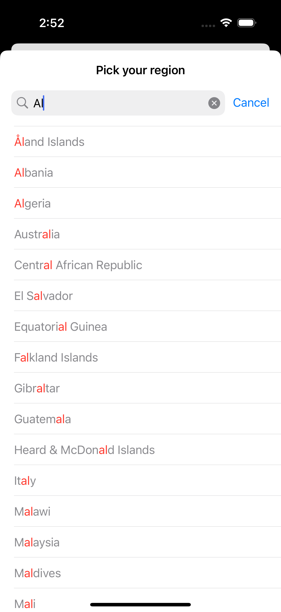

# Multilingual Searching

This reference project implements the usage of `localizedStandardRange(of:)` to solve the issues highlighted in [Build Multilingual-ready apps](https://developer.apple.com/videos/play/wwdc2024/10185) from WWD24. Specifically respecting local-specific conventions for spelling.

The project highlights the matched range of the search term in red, demonstrating the solution to another issue highlighted in the same WWDC session. For the best explanation watch 2 minutes of this [direct time link](https://developer.apple.com/videos/play/wwdc2024/10185?time=395). This app used red to be a more extreme and noticable difference, but in a real app you would likely use shades of grey.

The following screenshot shows the search in this app being local-aware (note: Å matches A) and using colour to highlight why the item matched the search term.

